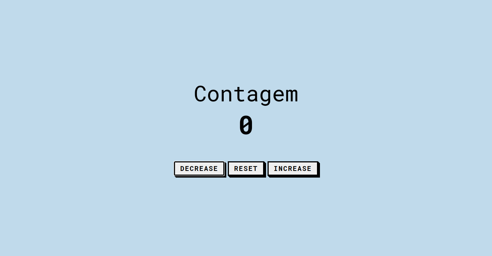
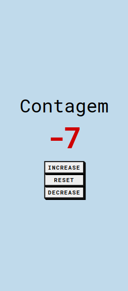
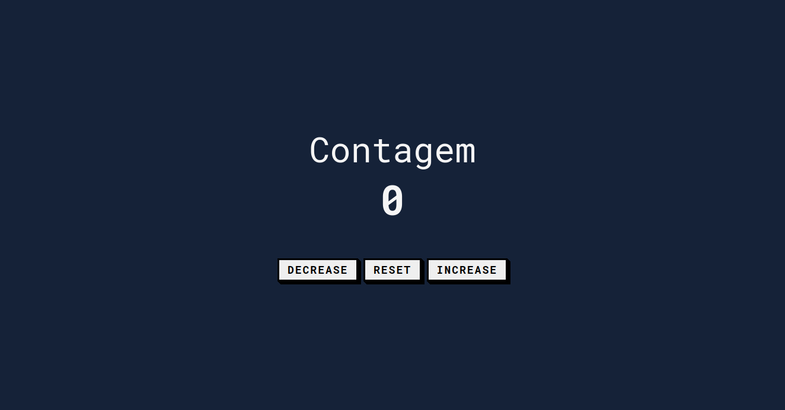
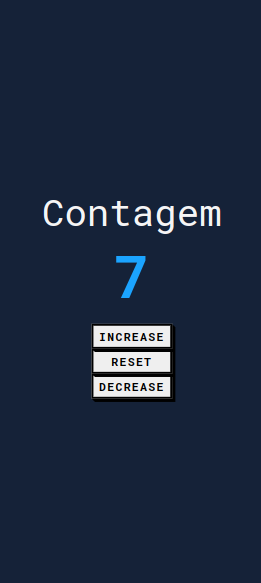

# 🔢 Count
<q>um contador que alteram a cor com base em números positivos ou negativos que são exibidos</q>
## 📜 Status
> Status: Finished

## 👨‍💻 Technology
> 
> 
> 

## 💻 Funcionalidades

> * <code>&lt;button/&gt;</code>  que <strong>aumente</strong> e/ou <strong>diminue</strong>;
> * A cor do contador muda Conforme a contagem aumenta🔴 ou diminui🔵;
> * Dependente do horario que estiver acessando o site ele muda de tema 🌙/🌞;   <code>[ new Date() | .getHours() ]</code>
> * Responsividade 📱;

## 👀 Preview
>  
> 
>  
 
